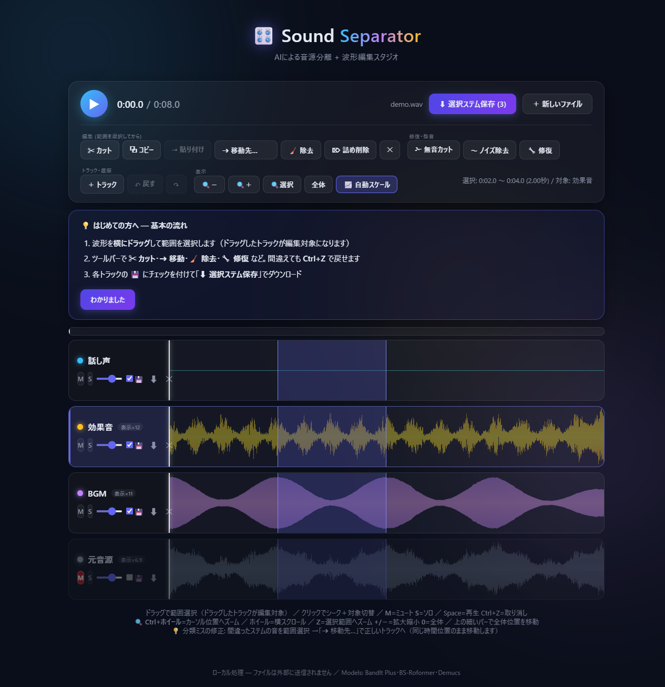
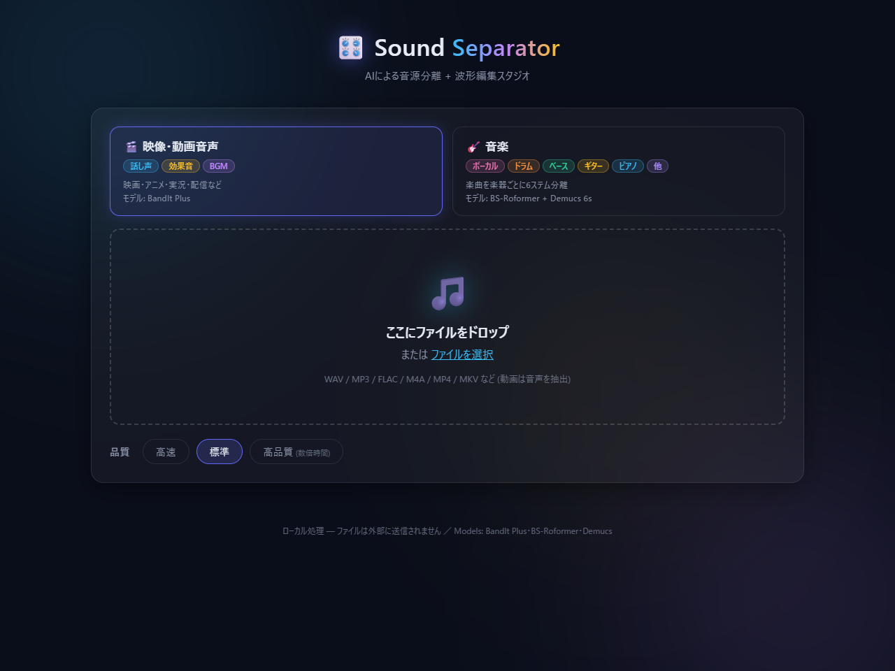
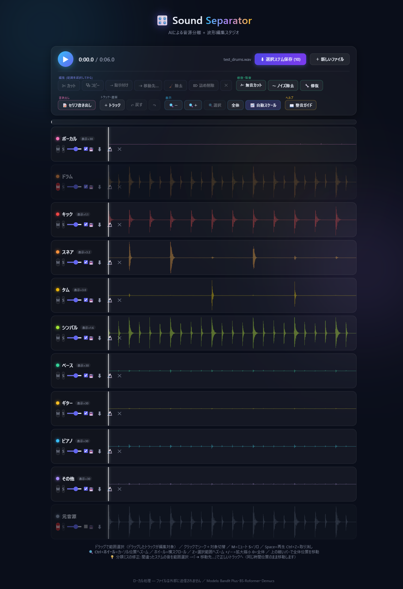
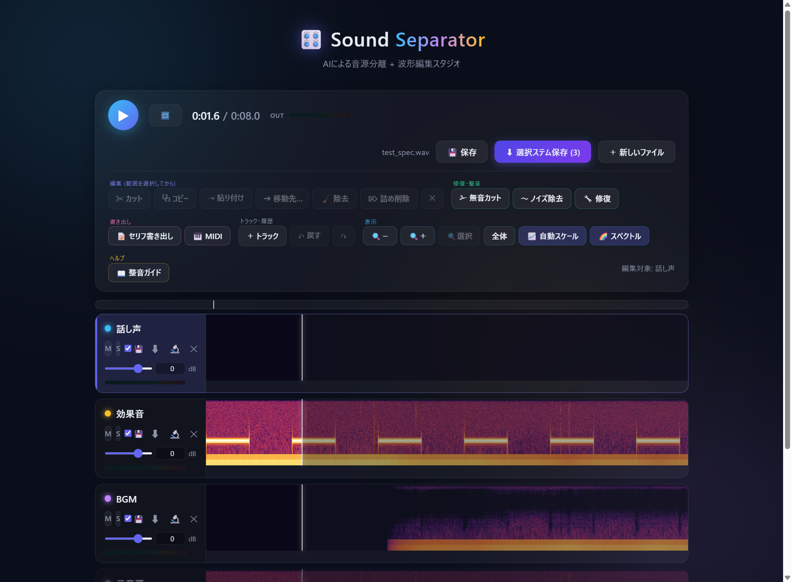
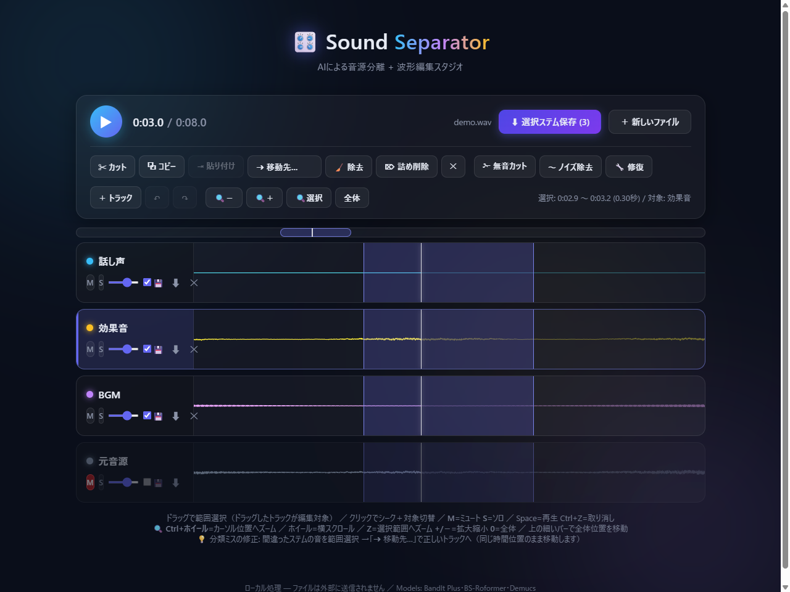
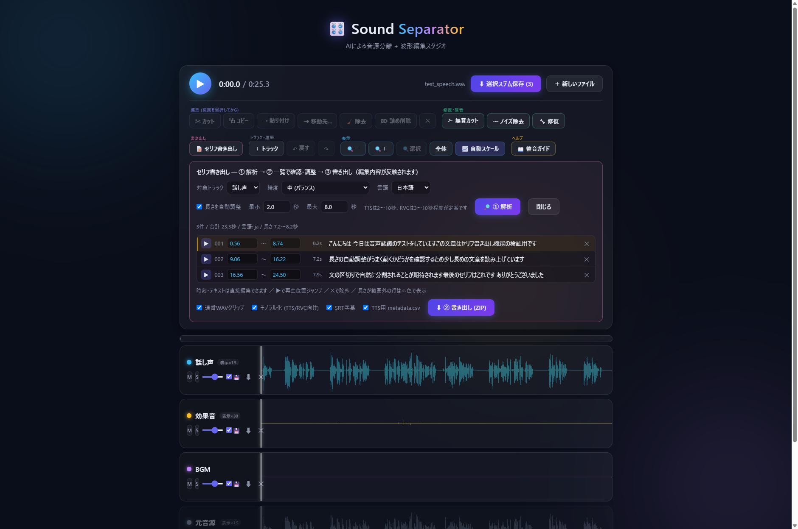
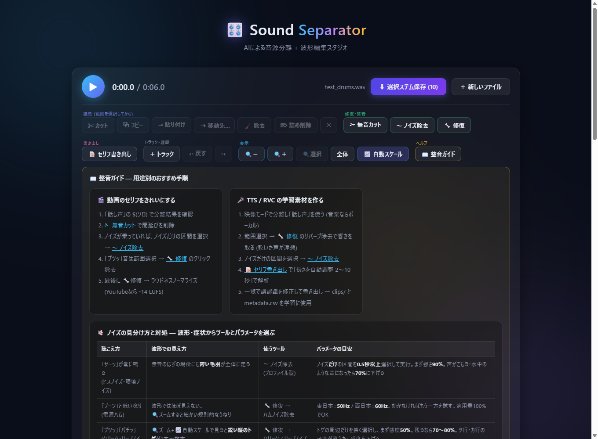

# Sound Separator 🎛️

音声・動画ファイルをAIでステム分離し、そのままブラウザ上で編集・修復できる**完全ローカル**のWebアプリ。
ファイルは一切外部に送信されません。



## 特徴

- 🎬 **映像・動画音声の3ステム分離** — 話し声 / 効果音 / BGM（BandIt Plus, DnR SDR 11.50）
- 🎸 **音楽の6ステム分離** — ボーカル / ドラム / ベース / ギター / ピアノ / その他（BS-Roformer → htdemucs_6s 多段パイプライン）
- ✂️ **波形編集** — カット / コピー / ステム間の移動・貼り付け / 詰め削除 / Undo・Redo
- 🔧 **範囲修復** — クリック・リップノイズ除去 / リバーブ除去(AI) / ハム除去 / ノイズプロファイル除去
- 🎨 色分け波形・同期再生・ミュート/ソロ・トラック追加/リネーム
- 🔍 **波形ズーム** — Ctrl+ホイールでカーソル位置へ拡大、サンプル単位まで表示。除去ポイントを正確に狙える
- 📝 **セリフ書き出し** — ローカルAI文字起こし (Whisper) でセリフ単位の連番WAV・SRT字幕・TTS学習用データ・アノテーションを一括生成
- 📦 編集内容を反映した WAV / ZIP 書き出し



## 機能一覧

| 分類 | 機能 |
|---|---|
| 🎬 分離 (映像・動画音声) | 話し声 / 効果音 / BGM の3ステム。高品質モードはアンサンブル |
| 🎸 分離 (音楽) | ボーカル / ドラム / ベース / ギター / ピアノ / その他 の6ステム (多段パイプライン) |
| 🔬 追加分離 | トラック単位でさらに細分化 — ドラム→キック / スネア / タム / シンバル、ボーカル→リード / バックコーラス |
| ✂️ 編集 | カット (トラック単位・尺不変) / コピー / 同位置ミックス貼り付け / ステム間移動 / 除去 / 詰め削除 (全トラック連動) / 無音カット (しきい値・最小長指定) / Undo・Redo 8段 |
| 🔧 修復 | クリック・リップノイズ除去 (感度調整) / リバーブ除去 (AI) / ハムノイズ除去 (50/60Hz+倍音) / ノイズプロファイル除去 |
| 🎚️ 整音 | フェードイン・アウト / ピークノーマライズ (-1dB) / ラウドネスノーマライズ (YouTube・Spotify・Apple・TikTok・Podcast・放送プリセット + カスタムLUFS) / **ピッチ変更** (±12半音・トラック単位) / **テンポ変更** (50〜200%・全トラック連動・ピッチ維持) |
| 📦 バッチ | 複数ファイルをまとめてドロップ → 順番に一括分離 → 各ファイルのZIPをダウンロード |
| 📝 セリフ書き出し | ローカルAI文字起こし (3精度・日英+自動判定) / クリップ長の自動調整 (最小〜最大秒・文の区切り優先) / **話者分離** (自動 or 人数指定、話者別フォルダ書き出し・一覧で修正可) / 一覧での時刻・テキスト手動修正 / 連番WAVクリップ / SRT字幕 (話者名プレフィックス) / TTS用 metadata.csv (話者列対応) / annotations.json・csv |
| 🎛️ トラック | 追加 (無音トラック) / リネーム (ダブルクリック) / 削除 / ミュート・ソロ・音量 |
| 🔍 表示 | ズーム (Ctrl+ホイール・カーソル中心) / 横スクロール / 選択範囲ズーム / 全体ミニマップ / 波形自動スケール (倍率バッジ) / **スペクトログラム表示切替** / 再生追従 |
| ▶️ 再生 | 同期再生 / クリックシーク / **選択範囲のループ再生** (🔁 / Lキー) |
| 💾 プロジェクト | 編集状態を .ssproj に保存 → ドロップで続きから再開 (トラック・音量・名前・編集すべて復元) |
| 🎹 MIDI書き出し | ローカルAI採譜 (basic-pitch) でトラック→.mid 変換 (感度・最短ノート調整可) |
| 🎚️ ミキサー | 音量はdB表示+数値入力 / トラック別レベルメーター / マスターメーター+クリップ警告 |
| 📦 保存 | ステムごとの💾チェックで選択保存 (ZIP / 単体WAV) / 個別WAV保存 / すべて編集内容反映 |
| 📖 ガイド | 初回チュートリアル / 用途別整音ガイド (動画セリフ・TTS/RVC素材・ボーカル抜き) / ノイズの見分け方と対処表 (波形の見え方→ツール→パラメータ目安) |
| 🔒 プライバシー | 完全ローカル処理。ファイル・音声は外部送信されません |

## 動作環境

| | 必要 | 推奨 |
|---|---|---|
| OS | Windows 10/11 64bit | Windows 11 |
| GPU | NVIDIA (VRAM 6GB) ※CPUのみでも動くが数十倍遅い | RTX 3080 / 4070 以上 (VRAM 12GB+) |
| RAM | 16GB | 32GB |
| ディスク | 約12GB (venv ~6GB + モデル ~2GB + 作業領域) | SSD |
| その他 | [uv](https://docs.astral.sh/uv/)・[ffmpeg](https://ffmpeg.org/) が PATH にあること | |

参考: RTX 4090 では8秒の音声を標準品質で約2〜5秒で分離します。

### 機能別の目安

| 機能 | モデルDL (初回のみ) | VRAM目安 | 備考 |
|---|---|---|---|
| 分離 (映像・動画音声) | 142MB (+高品質時153MB) | 4GB〜 | |
| 分離 (音楽6ステム) | 610MB + 170MB | 6GB〜 (8GB推奨) | 2段階処理のためやや時間がかかる |
| 追加分離 (ドラム細分化) | 170MB | 4GB〜 | |
| 追加分離 (リード/バック) | 900MB | 6GB〜 | |
| リバーブ除去 | 913MB | 6GB〜 | |
| セリフ書き出し (文字起こし) | 小0.5GB / 中1.4GB / 大3GB | 2 / 5 / 10GB | 精度とトレードオフ |
| ノイズ除去・クリック除去・ハム除去 | 不要 | 不要 (CPU処理) | 数秒で完了 |
| 波形編集・ズーム・保存 | 不要 | 不要 (ブラウザ内処理) | 即時 |

GPUが無い場合もAI系機能は動作しますが、数十倍遅くなります。モデルは同時に読み込んだ分だけVRAMを消費します (合計が上限を超える場合はサーバー再起動でリセット)。

## セットアップ

```
git clone https://github.com/midorin40/SoundtSeparator.git
cd SoundtSeparator
setup.bat        ← ダブルクリックでも可 (venv作成 + 依存インストール)
```

AIモデル（合計 約2GB）は**初回使用時に自動ダウンロード**されます（進捗はUIに表示）。

## 起動

`run.bat` をダブルクリック → ブラウザで http://127.0.0.1:8765 が開きます。

## 使い方

### 1. 分離

1. モード（🎬映像・動画音声 / 🎸音楽）を選ぶ
2. ファイルをドロップ（WAV / MP3 / FLAC / M4A / MP4 / MKV など。動画は音声を自動抽出）。**複数まとめてドロップすると一括分離モード**になり、順番に処理して各ファイルのZIPをダウンロードできます
3. 品質を選ぶ
   - **高速** … プレビュー向き
   - **標準** … 通常はこれで十分
   - **高品質** … 数倍時間。映像モードでは CDX23 (Demucs4×3) とのアンサンブル

**🔬 トラックの追加分離**: 分離後、各トラックの🔬ボタンからさらに細かく分けられます。



- ドラム → **キック / スネア / タム / シンバル** (DrumSep)
- ボーカル・話し声 → **リードボーカル / バックコーラス・ハモリ** (Karaoke Roformer)
- 元のトラックは残ります (ミュートされ、新トラックが直後に追加されます)
- ※ シンセFX・ライザー等を独立ステムにする公開モデルは現状なく、「その他」に残ります

### 2. 確認・ミックス

- 色分けされた波形で表示。**M**=ミュート / **S**=ソロ
- 音量は**dB単位**でスライダー+数値入力 (−60〜+12dB)。トラックごとに**レベルメーター**、右上に**マスターメーター**があり、音割れすると**CLIPが赤く点灯**します（点いたら音量を下げる）
- 波形は**自動スケール表示**（音の小さいステムも形が見えるよう表示だけ拡大。倍率は「表示×N」バッジに表示、実際の音量は不変。📈ボタンでOFF可）
- 「元音源」トラックはA/B比較用（初期ミュート）
- 波形クリックでシーク、Space で再生/停止
- 初回は画面上に基本の流れ（選択→編集→保存）のガイドが表示されます
- **🔁 ループ再生**（Lキー）: 選択範囲をリピート。修復パラメータの聴き比べに便利
- **🌈 スペクトログラム表示**: 縦=周波数（対数軸・上が高音）、明るさ=音量。ハムは横線、クリックは縦線、ヒスは面のざらつきとして見えるため、ノイズ探しは波形より確実です



- **💾 保存（プロジェクト）**: 編集状態を `.ssproj` ファイルに保存。次回そのファイルをドロップすると、トラック構成・名前・音量・編集内容ごと復元されます

**波形ズーム**（細かいノイズの位置を正確に特定できます）



| 操作 | 動作 |
|---|---|
| Ctrl+ホイール (波形上) | カーソル位置を中心に拡大/縮小 |
| ホイール (波形上・ズーム中) | 横スクロール |
| 🔍＋ / 🔍− ボタン、`+` / `-` キー | 拡大 / 縮小 |
| 🔍選択 ボタン、`Z` キー | 選択範囲へズーム |
| 全体 ボタン、`0` キー | 全体表示に戻す |
| トラック上部の細いバー | 全体ミニマップ。クリック/ドラッグで表示位置を移動 |

サンプル単位まで拡大すると折れ線表示に切り替わり、クリックノイズの位置が正確に見えます。再生中は表示範囲が自動で追従します。

### 3. 編集（ドラッグで範囲選択 → ドラッグしたトラックが編集対象）

| 操作 | 動作 | ショートカット |
|---|---|---|
| ✂ カット | 選択トラックから切り取り（その場は無音、尺不変） | Ctrl+X |
| ⧉ コピー / ⇥ 貼り付け | 貼り付け先トラックをクリックして選び、**元と同じ時間位置**にミックス | Ctrl+C / Ctrl+V |
| ➜ 移動先… | 分類ミスの修正。選択範囲を別トラックへワンクリック移動（例: 効果音に入ったため息を話し声へ） | |
| 🧹 除去 | いらない音をその場で消す（尺・クリップボード不変） | Delete |
| ⌦ 詰め削除 | 全トラックから削除して前後を詰める（尺が縮む） | Shift+Delete |
| ✁ 無音カット | しきい値・最小長を指定して無音区間を自動削除 | |
| ↶↷ Undo / Redo | 8段階 | Ctrl+Z / Ctrl+Y |

すべての編集境界には10msのフェードが自動で入り、クリックノイズを防ぎます。

### 4. 修復（🔧 修復パネル・選択範囲に適用）


- **クリック / リップノイズ除去** — インパルス検出+補間（感度調整可）
- **リバーブ除去** — AIモデル（初回 約900MB DL）
- **ハムノイズ除去** — 50/60Hz+倍音のノッチフィルタ
- **フェードイン / フェードアウト / ピークノーマライズ(-1dB)**
- **ラウドネスノーマライズ** — 配信プラットフォーム別プリセット（YouTube / Spotify -14、Apple Music / Podcast -16、TikTok -14、テレビ放送 -24 LUFS、カスタム値可）。ITU-R BS.1770準拠の測定でトラック全体を目標値に調整、クリップ防止付き
- **ピッチ変更** — 選択トラック全体を±12半音（0.5刻み）。長さ不変。RVC素材のキー合わせに
- **テンポ変更** — 全トラック連動で50〜200%。ピッチは維持され、尺が変わります（Ctrl+Zで復帰可）
- **〜 ノイズ除去** — ノイズだけの区間を選択→プロファイル学習→トラック全体から除去

### 5. セリフ書き出し（📝 ツールバー）



対象トラック（話し声など）をローカルAI (Whisper) で文字起こしし、以下を一括生成してZIPでダウンロードできます。**編集した内容がそのまま反映されます**。

**① 解析 → ② 一覧で確認・調整 → ③ 書き出し** の流れです。

- **クリップ長の自動調整**: TTS/RVCの学習に適した長さ（最小〜最大秒を指定、既定2〜10秒）に収まるよう、**文の区切り・無音を優先して自動で結合・分割**します。単語レベルのタイムスタンプで分割するのでテキストとの対応が壊れません
- **話者分離**: 声の特徴からセリフごとに話者（話者A/B/...）を自動推定（人数指定も可）。クリップは**話者別フォルダ**に書き出され、metadata.csvに話者列、SRTに話者名が付きます。判定ミスは一覧の話者セレクトで修正できます。複数話者の会話からTTS/RVC素材を作るときは、話者交代を保つため「長さを自動調整」をオフにするのがおすすめ
- **手動調整**: 解析結果の一覧で、各セリフの**開始/終了時刻・テキスト・話者を直接編集**、✕で除外。範囲外の長さの行は⚠色で警告表示。▶でその位置にジャンプして耳で確認できます

| 出力 | 形式 | 用途 |
|---|---|---|
| `clips/名前_0001.wav` … | セリフ単位の連番WAV（前後0.15秒の余白+フェード付き、モノラル化可） | 素材整理・データセット |
| `subtitles.srt` | SRT字幕（タイムコード+テキスト） | 動画編集ソフトにそのまま読込 |
| `metadata.csv` | `ファイル名\|テキスト`（LJSpeech形式） | TTS（音声合成）の学習データ |
| `annotations.json` / `.csv` | 番号・開始/終了時刻・長さ・テキスト | アノテーション・後処理 |

- 精度は3段階（小/中/大）。言語は自動判定・日本語・英語から選択
- 音声認識モデルは初回使用時に自動ダウンロード（中: 約1.4GB / 大: 約3GB）
- 検出結果は一覧表示され、行をクリックするとその位置にジャンプ+範囲選択されます（誤認識箇所の確認・修正に便利）

### 6. MIDI書き出し（🎹 ツールバー）

トラックをローカルAI (basic-pitch) で採譜し、MIDIファイルに変換します。ピアノ・ギター・ベース・ボーカルメロディの採譜向き（ドラム・複雑なミックスは不向き。先に分離してから実行を）。感度と最短ノート長を調整できます。

### 7. 整音ガイド（📖 ツールバー）



初心者向けに、用途別のおすすめ手順（動画のセリフ整音 / TTS・RVC学習素材づくり / ボーカル抜き音源）をアプリ内で確認できます。各ステップから該当ツールを直接開けます。ツールバーは機能グループごとに色分けされています（編集=藍 / 修復・整音=緑 / 書き出し=ピンク / 表示=空 / ヘルプ=黄）。

### 8. 書き出し

- 各トラックの **💾チェックボックス** で保存対象を選択 →「⬇ 選択ステム保存」でZIP一括（1つだけならWAV直接保存）
- トラックごとの⬇ボタンで個別WAV保存も可能
- **編集内容がそのまま反映されます**

## 使用モデル

| 用途 | モデル | サイズ (自動DL) | 重みのライセンス |
|---|---|---|---|
| 話し声/効果音/BGM | [BandIt Plus](https://github.com/ZFTurbo/Music-Source-Separation-Training) (DnR SDR 11.50) | 142MB | 未明示 (リポジトリはMIT) |
| ボーカル抽出 | BS-Roformer viperx ep317 (SDR 12.97) | 610MB | 未明示 (コミュニティ公開) |
| 楽器6分割 | htdemucs_6s | ~170MB | MIT |
| 高品質アンサンブル | [MVSEP-CDX23](https://github.com/ZFTurbo/MVSEP-CDX23-Cinematic-Sound-Demixing) ×3 | 153MB | 未明示 |
| リバーブ除去 | [anvuew MelBand Roformer](https://huggingface.co/anvuew/dereverb_mel_band_roformer) (SDR 19.17) | 913MB | GPL-3.0 |
| ドラム細分化 | DrumSep htdemucs (inagoy) | 167MB | 未明示 |
| リード/バック分離 | MelBand Roformer Karaoke (aufr33/viperx) | 913MB | 未明示 (コミュニティ公開) |

## ライセンスについて

- **アプリ本体のコード** (app/ など): 本リポジトリの作者による独自実装
- **engine/msst/**: [Music-Source-Separation-Training](https://github.com/ZFTurbo/Music-Source-Separation-Training) (MIT License, Roman Solovyev/ZFTurbo氏) を推論用パッチ込みで同梱。LICENSEファイルを保持しています
- **AIモデルの重みは本リポジトリに含まれません**。初回使用時に各配布元からユーザー環境へ自動ダウンロードされ、それぞれの配布条件が適用されます (上表参照)。重みの再配布や、分離結果の商用利用を行う場合は各配布元の条件を必ず確認してください
- 主要依存パッケージ: PyTorch (BSD-3)、FastAPI (MIT)、demucs (MIT)、noisereduce (MIT)、pyloudnorm (MIT)、librosa (ISC) など

## 技術構成

- バックエンド: Python 3.11 / FastAPI / PyTorch 2.6 (CUDA 12.4)
- 分離エンジン: [Music-Source-Separation-Training](https://github.com/ZFTurbo/Music-Source-Separation-Training) (MSST) フレームワーク — `engine/msst/` に推論用軽量化パッチ込みで同梱
- DSP修復: numpy / scipy（declick=微分外れ値検出+補間, dehum=iirnotch）、ノイズ除去: noisereduce
- フロントエンド: Vanilla JS + Web Audio API + Canvas（ライブラリ不使用。編集・WAVエンコード・ZIP生成もクライアントサイド）

```
SoundtSeparator/
├── setup.bat / run.bat   … セットアップ / 起動
├── app/
│   ├── server.py         … FastAPI (ジョブ管理 / denoise / effect API)
│   ├── separator.py      … 分離エンジン (モデル遅延ロード+キャッシュ)
│   ├── repair.py         … DSP修復
│   └── static/           … フロントエンド
├── engine/msst/          … MSST フレームワーク (パッチ済み同梱)
├── models/               … モデルチェックポイント (自動DL・git管理外)
└── output/               … 分離結果 (git管理外)
```

### MSST への加えたパッチ

推論に不要な学習用依存 (asteroid / pytorch_lightning など) を避けるため:

- `engine/msst/models/bandit/core/__init__.py` … 学習用コードを空に
- `engine/msst/models/bandit/core/model/bsrnn/wrapper.py` … LightningModule → nn.Module
